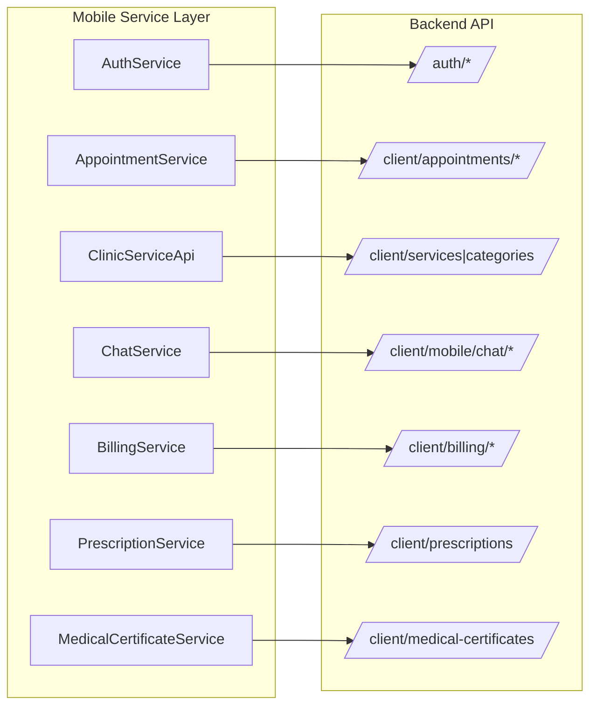
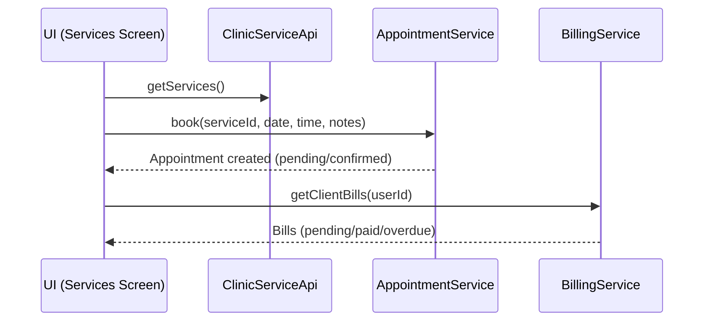

## Dr. Ve Aesthetic App – Architecture Overview

This document describes the layered architecture of the mobile app and its interaction with the backend APIs.

### 1) High-Level Context

```mermaid
flowchart TB
  User((Client User))
  App[Mobile App (Expo/React Native)]
  API[Backend API (Laravel)]

  User --> App
  App --> API
```

### 2) Mobile App Layers (Client)

```mermaid
flowchart TB
  subgraph Mobile[Mobile App (Expo/React Native)]
    direction TB
    UI[UI Layer\n(Screens, Components)]
    State[State & Context\n(AuthContext, hooks)]
    Services[Service Layer\n(API wrappers in lib/api/*)]
    Security[Security Helpers\n(InputValidator, AuditLogger, RateLimiter)]
  end

  UI --> State
  State --> Services
  UI --> Services
  Services --> Security
```

- UI Layer: `app/*` screens, `components/*` UI components
- State & Context: `lib/context/AuthContext.tsx`, hooks, session handling
- Service Layer: `lib/api/*` typed API clients (auth, appointments, services, chat, billing, prescriptions, certificates)
- Security Helpers: `lib/security/*` input validation, audit logging, rate limiting

### 3) API Surface (Backend Endpoints Used)



Key backend groups (as per `lib/api/config.ts`):
- Auth: `/client/auth/*`
- Appointments: `/client/appointments`, `/client/users/{id}/appointments`
- Services & Categories: `/client/services`, `/client/categories`
- Chat (mobile): `/client/mobile/chat/*`
- Billing: `/client/billing/*`, legacy `/client/bills/{clientId}`
- Prescriptions: `/client/prescriptions`
- Medical Certificates: `/client/medical-certificates`

### 4) Feature Cross-Cuts

```mermaid
flowchart TB
  Push[Push Notifications]
  Nav[Navigation (expo-router)]
  Storage[Secure Storage (AuthStorage)]

  UI -. uses .-> Nav
  State -. persists .-> Storage
  Services -. triggers .-> Push
```

- Navigation: `expo-router`, stack screens in `app/_layout.tsx`
- Storage: `AuthStorage` for tokens/user; session-aware redirects in `app/index.tsx`
- Notifications: `lib/notifications/PushNotificationService.ts`

### 5) Data Flow – Example (Booking -> Billing)



### 6) Environment & Build
- Expo SDK app with native modules (downloads/sharing, push, Google config possible)
- For full functionality on device, use a custom dev client or EAS build
- Directory hints: `android/` present; `google-services.json` configured

### 7) Files and Directories
- Screens: `app/*.tsx` (e.g., `home.tsx`, `appointments.tsx`, `billing.tsx`)
- Components: `components/*` (e.g., `BottomNavigation.tsx`, dialogs, forms)
- API Clients: `lib/api/*` (typed services)
- Security: `lib/security/*`
- Docs: `docs/*` (visualization, requirements, this architecture doc)

---

Tips
- Edit this file and commit Mermaid diagrams with your changes
- GitHub/GitLab render Mermaid out of the box
- For more structured views, consider the C4 model (Context/Container/Component)


